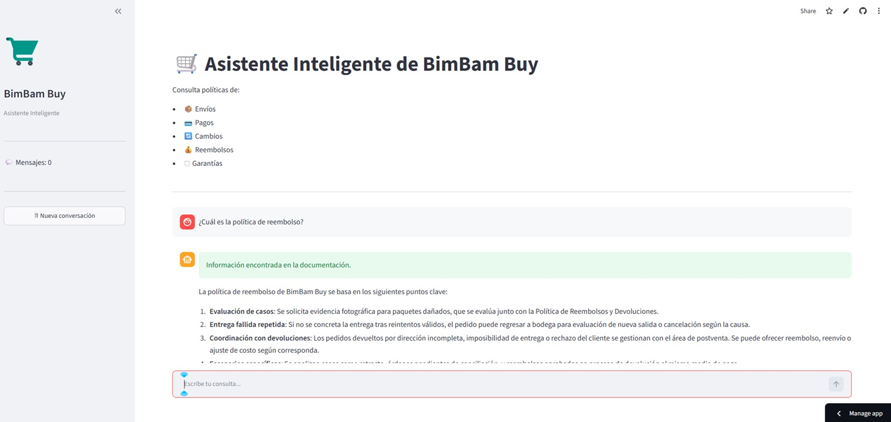

# 🛒 Asistente Inteligente de BimBam Buy

Asistente conversacional basado en **RAG (Retrieval-Augmented Generation)** desarrollado con **Python**, **LangChain**, **Cohere**, **FAISS**, **Hugging Face** y **Streamlit**.

El agente responde preguntas utilizando exclusivamente la información contenida en la documentación interna de BimBam Buy, mostrando además las fuentes utilizadas para generar cada respuesta.

---

# 🚀 Demo

> *(Agregar aquí una captura de pantalla o un video una vez realizado el deploy en Oracle Cloud.)*



---

# ✨ Funcionalidades

- Chat conversacional.
- Memoria de la conversación.
- Búsqueda semántica mediante embeddings.
- Recuperación automática de documentos relevantes (RAG).
- Respuestas generadas mediante Cohere.
- Visualización de los fragmentos utilizados como fuente.
- Manejo elegante de errores.
- Respuesta controlada cuando la información no existe en la documentación.
- Interfaz web desarrollada con Streamlit.

---

# 🏗 Arquitectura

```
Usuario
      │
      ▼
 Streamlit
      │
      ▼
 LangChain
      │
      ▼
 FAISS
      │
      ▼
Embeddings (HuggingFace)
      │
      ▼
Documentos PDF
      │
      ▼
 Cohere (LLM)
      │
      ▼
Respuesta al usuario
```

---

# 🛠 Tecnologías utilizadas

- Python
- Streamlit
- LangChain
- Cohere
- Hugging Face Embeddings
- FAISS
- PyPDF
- dotenv

---

# 📂 Estructura del proyecto

```
bimbam_rag/

│
├── app.py
├── requirements.txt
├── README.md
├── .env
│
├── documentos/
│
├── vectorstore/
│
└── src/
    ├── config.py
    ├── loader.py
    ├── prompts.py
    ├── rag.py
    └── vectorstore.py
```

---

# ⚙ Instalación

Crear un entorno virtual:

```bash
python -m venv .venv
```

Activarlo:

Windows

```bash
.venv\Scripts\Activate.ps1
```

Linux / Mac

```bash
source .venv/bin/activate
```

Instalar dependencias:

```bash
pip install -r requirements.txt
```

Crear un archivo `.env`:

```env
COHERE_API_KEY=TU_API_KEY
```

---

# ▶ Ejecutar la aplicación

```bash
streamlit run app.py
```

---

# 📚 Funcionamiento

1. El usuario realiza una consulta.
2. Se generan embeddings de la pregunta.
3. FAISS recupera los documentos más relevantes.
4. Se construye un prompt con:
   - historial,
   - contexto,
   - pregunta.
5. Cohere genera la respuesta.
6. Se muestran los documentos utilizados como respaldo.

---

# 🌎 Despliegue

La aplicación será desplegada en **Oracle Cloud Infrastructure (OCI)**.

Los documentos PDF y el índice vectorial serán almacenados en la infraestructura de Oracle para permitir consultas desde la aplicación publicada.

---

# 🔮 Mejoras futuras

- Carga dinámica de documentos.
- Panel de administración.
- Autenticación de usuarios.
- Base de datos para historial de conversaciones.
- Re-ranking de documentos.
- Streaming de respuestas.
- Métricas y monitoreo.

---

# 👨‍💻 Autor

Proyecto desarrollado por **Facundo Buzzetti** como desafío de Inteligencia Artificial utilizando técnicas de Retrieval-Augmented Generation (RAG).